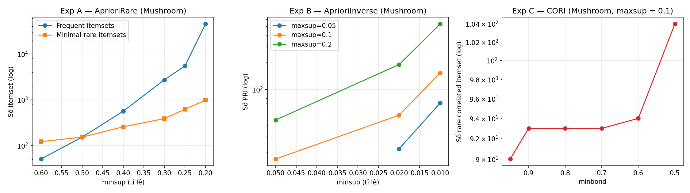
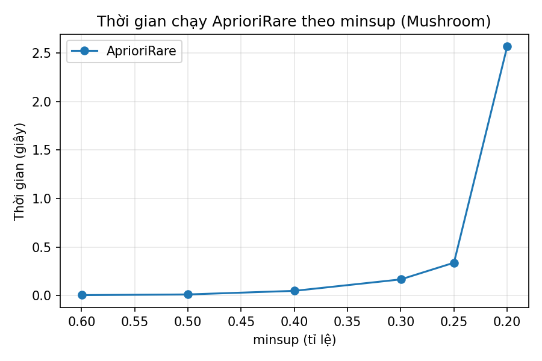

# Tóm tắt

Khai thác tập mục phổ biến (FIM) bỏ qua các mẫu xuất hiện ít nhưng giá trị cao —
mẫu hiếm — trong khi việc hạ ngưỡng hỗ trợ một cách thô sơ lại gây bùng nổ tổ hợp và
nhiễu. Báo cáo này nghiên cứu hệ thống bài toán khai thác mẫu hiếm (Rare Pattern
Mining): so sánh ba định nghĩa hình thức (infrequent, minimal rare, perfectly rare
itemset); phân tích ba thuật toán AprioriRare, AprioriInverse và CORI cùng các độ đo
tương quan bond, all-confidence và tính null-invariance. Toàn bộ thuật toán được cài
đặt lại bằng Python (thư viện chuẩn) và kiểm chứng tự động bằng 19 câu lệnh assert đối
chiếu với kết quả tính tay trên ví dụ minh họa — đạt 100%. Thực nghiệm trên bộ dữ
liệu UCI Mushroom
(8 124 giao dịch) định lượng hóa các đánh đổi lý thuyết: chi phí duyệt vùng phổ biến
của AprioriRare (45 391 itemset phổ biến để tìm 986 mRI ở minsup = 0.2), hiệu quả thu
hẹp không gian của AprioriInverse, và chất lượng ngữ nghĩa của các mẫu hiếm tương quan
bond = 1 mà CORI phát hiện. Báo cáo khép lại bằng tổng quan bốn dòng nghiên cứu
2021–2026: mở rộng biểu diễn dữ liệu, kết hợp tiện ích, bảo vệ quyền riêng tư và các
ứng dụng y tế/công nghiệp.

**Từ khóa:** rare pattern mining, minimal rare itemset, perfectly rare itemset,
AprioriRare, AprioriInverse, CORI, bond, all-confidence, null-invariance.

# Chương 1. Mở đầu

## 1.1. Bối cảnh và lý do chọn đề tài

Khai thác tập mục phổ biến (Frequent Itemset Mining — FIM) là bài toán nền tảng của
khai thác dữ liệu: cho một cơ sở dữ liệu giao dịch $D$ và ngưỡng $minsup$ do người dùng
đặt, FIM liệt kê mọi tập mục (itemset) $X$ có độ hỗ trợ $sup(X) \ge minsup$ [1]. Tuy
nhiên, khi dùng FIM người ta thường ngầm coi "phổ biến" là "đáng quan tâm" — cách
dùng này không phù hợp trong nhiều ứng dụng thực tế. Trong y tế, các tổ hợp triệu chứng
của bệnh hiếm xuất hiện với tần suất rất thấp nhưng mang giá trị chẩn đoán cao [21];
trong công nghiệp, các lỗi sản phẩm hiếm gặp lại chính là đối tượng cần phát hiện [14];
trong an ninh mạng, hành vi bất thường theo định nghĩa là hành vi hiếm [16]. Những mẫu
như vậy bị FIM truyền thống bỏ qua hoàn toàn.

Bài toán **khai thác mẫu hiếm** (Rare Pattern Mining) ra đời để lấp khoảng trống này.
Khó khăn cốt lõi nằm ở chỗ: nếu chỉ đơn giản hạ thấp $minsup$, số lượng itemset bùng nổ
tổ hợp và phần lớn mẫu thu được là nhiễu — thậm chí nhiều "mẫu hiếm" có độ hỗ trợ bằng 0,
tức không hề tồn tại trong dữ liệu. Vì vậy, cộng đồng nghiên cứu đã đề xuất các định nghĩa
chặt chẽ hơn về "mẫu hiếm có ý nghĩa" (minimal rare itemset [5], perfectly rare itemset
[4]) cùng các thuật toán khai thác tương ứng, và bổ sung các độ đo tương quan
(bond, all-confidence [3]) để loại bỏ các mẫu giả (spurious patterns) — các tập mục
chỉ tình cờ đi cùng nhau.

Báo cáo này nghiên cứu hệ thống các kỹ thuật trên, dựa theo khung nội dung bài giảng
"Rare Itemset Techniques" của môn học, đồng thời tự cài đặt và kiểm chứng thực nghiệm
toàn bộ thuật toán bằng Python.

## 1.2. Mục tiêu

1. Trình bày và so sánh ba định nghĩa hình thức của mẫu hiếm: *infrequent itemset*,
   *minimal rare itemset* (mRI) và *perfectly rare itemset* (PRI).
2. Phân tích ba thuật toán: **AprioriRare** [5], **AprioriInverse** [4] và **CORI** [7],
   cùng các độ đo tương quan **bond**, **all-confidence** [3] và khung độ đo thống nhất
   của Wu và cộng sự [6].
3. Cài đặt toàn bộ thuật toán bằng Python (chỉ dùng thư viện chuẩn), **kiểm chứng tự động
   100% kết quả** so với ví dụ trong bài giảng, và khảo sát hành vi thuật toán trên bộ dữ
   liệu thực UCI Mushroom.
4. Tổng quan hướng nghiên cứu giai đoạn 2021–2026 của lĩnh vực.

## 1.3. Phạm vi

Báo cáo giới hạn ở khai thác itemset hiếm trên cơ sở dữ liệu giao dịch tĩnh — đúng phạm
vi bài giảng gốc. Các hướng mở rộng (mẫu hiếm tuần tự, mẫu hiếm tiện ích cao, dữ liệu
luồng, dữ liệu không chắc chắn) chỉ được điểm qua ở phần tổng quan và hướng phát triển.

## 1.4. Cấu trúc báo cáo

Chương 2 trình bày cơ sở lý thuyết và tổng quan nghiên cứu; Chương 3 phân tích chi tiết
các thuật toán và độ đo; Chương 4 mô tả cài đặt và kết quả thực nghiệm; Chương 5 kết luận
và nêu hướng phát triển.

# Chương 2. Cơ sở lý thuyết và tổng quan nghiên cứu

## 2.1. Bài toán khai thác tập mục phổ biến

**Định nghĩa 2.1 (CSDL giao dịch).** Cho tập mục $I = \{i_1, i_2, \dots, i_m\}$.
Một *giao dịch* $T$ là một tập con của $I$. CSDL giao dịch $D = \{T_1, \dots, T_n\}$
là một tập hữu hạn các giao dịch.

**Định nghĩa 2.2 (Độ hỗ trợ hội — conjunctive support).** Độ hỗ trợ của itemset $X$
là số giao dịch chứa toàn bộ $X$:
$$sup(X) = |\{T \mid X \subseteq T \wedge T \in D\}|$$

**Định nghĩa 2.3 (FIM).** Cho ngưỡng $minsup > 0$, khai thác tập mục phổ biến là liệt kê
mọi $X \subseteq I$ sao cho $sup(X) \ge minsup$ [1].

Tính chất nền tảng của FIM là tính **anti-monotone** của support: nếu $X \subset Y$ thì
$sup(Y) \le sup(X)$. Apriori [1] khai thác tính chất này theo chiều rộng (sinh ứng viên
theo mức), còn Eclat [2] duyệt theo chiều sâu trên biểu diễn dọc (mỗi itemset giữ một
TID-list — danh sách giao dịch chứa nó).

**Ví dụ.** Báo cáo dùng CSDL 4 giao dịch trong bài giảng
(bảng 2.1) làm ví dụ chạy tay và kiểm chứng cài đặt.

| Giao dịch | Các mục |
|---|---|
| T1 | {pasta, lemon, bread, orange} |
| T2 | {pasta, lemon} |
| T3 | {pasta, orange, cake} |
| T4 | {pasta, lemon, orange, cake} |

*Bảng 2.1 — CSDL giao dịch ví dụ (theo bài giảng).*

Với $minsup = 2$, kết quả FIM gồm 11 itemset phổ biến: 4 itemset đơn {lemon}, {pasta},
{orange}, {cake}; 5 itemset đôi {lemon, pasta}, {lemon, orange}, {pasta, orange},
{pasta, cake}, {orange, cake}; và 2 itemset ba {lemon, pasta, orange},
{pasta, orange, cake} (chi tiết tại mục 4.2).

## 2.2. Ba định nghĩa về mẫu hiếm

### 2.2.1. Itemset không phổ biến (infrequent itemset)

**Định nghĩa 2.4.** Itemset $X$ là *không phổ biến* nếu $sup(X) < minsup$.

Đây là định nghĩa "phần bù" trực tiếp của FIM, nhưng có hai nhược điểm nghiêm trọng
được chỉ rõ trong bài giảng: (i) số lượng itemset không phổ biến cực lớn (bùng nổ tổ
hợp ở phần trên của dàn — lattice); (ii) nhiều itemset không phổ biến **không hề tồn
tại** trong dữ liệu ($sup = 0$), ví dụ {bread, cake} trong bảng 2.1. Khai thác trực
tiếp theo định nghĩa này vừa tốn kém vừa vô nghĩa.

### 2.2.2. Itemset hiếm tối thiểu (minimal rare itemset — mRI)

**Định nghĩa 2.5** (Szathmary và cộng sự [5]). Itemset $X$ là *hiếm tối thiểu* nếu
$sup(X) < minsup$ **và** mọi tập con thực sự của $X$ đều phổ biến:
$\forall Y \subset X: sup(Y) \ge minsup$.

Trong dàn itemset, vùng phổ biến (chứa $\emptyset$) và vùng hiếm tách nhau bởi một
**đường biên**: mRI chính là *biên dưới của vùng hiếm* — các điểm hiếm "đầu tiên" ngay
khi vượt qua vùng phổ biến. Tập mRI vì vậy nhỏ gọn và giàu thông tin: mọi itemset hiếm
khác rỗng đều là tập cha của một mRI nào đó. Với bảng 2.1 và $minsup = 2$: mRI gồm
**{bread}** ($sup = 1$) và **{lemon, cake}** ($sup = 1$).

### 2.2.3. Itemset hiếm hoàn hảo (perfectly rare itemset — PRI)

**Định nghĩa 2.6** (Koh & Rountree [4]). Cho hai ngưỡng $minsup < maxsup$. Itemset $X$
là *hiếm hoàn hảo* nếu:
(i) $minsup \le sup(X) < maxsup$; và
(ii) mọi tập con khác rỗng $Y \subset X$ đều có $sup(Y) < maxsup$.

Định nghĩa này khắc phục cả hai nhược điểm của Định nghĩa 2.4: ngưỡng dưới $minsup$
loại các mẫu quá hiếm tới mức là nhiễu ngẫu nhiên (sporadic noise), còn điều kiện (ii)
đòi hỏi *mọi mục thành phần cũng phải hiếm* — mẫu hiếm "thuần khiết". Vì
$sup(Y) \le \min_{i \in Y} sup(\{i\})$, điều kiện (ii) tương đương với việc mọi item
của $X$ có support nhỏ hơn $maxsup$. Với bảng 2.1, $minsup = 1$, $maxsup = 1.9$:
PRI duy nhất là **{bread}**.

So sánh ba định nghĩa được tổng kết ở bảng 2.2.

| Tiêu chí | Infrequent | Minimal rare (mRI) | Perfectly rare (PRI) |
|---|---|---|---|
| Số ngưỡng | 1 (minsup) | 1 (minsup) | 2 (minsup, maxsup) |
| Kích thước kết quả | Bùng nổ | Gọn (biên) | Gọn |
| Chứa mẫu $sup=0$? | Có | Có thể¹ | Không (vì $sup \ge minsup$) |
| Cho phép chứa item phổ biến? | Có | Có | **Không** |
| Thuật toán | — | AprioriRare [5] | AprioriInverse [4] |

*Bảng 2.2 — So sánh ba định nghĩa mẫu hiếm. (¹: một mRI vẫn có thể có $sup = 0$ —
ví dụ hai item đều phổ biến nhưng không bao giờ đồng xuất hiện thì cặp của chúng có
$sup = 0$ và mọi tập con đều phổ biến, thoả Định nghĩa 2.5. Khác với định nghĩa
infrequent thô, tập mRI chỉ chứa số lượng rất nhỏ các mẫu như vậy — đúng các điểm
nằm trên biên.)*

## 2.3. Mẫu giả và nhu cầu về độ đo tương quan

Một itemset phổ biến không nhất thiết "đáng tin". Trong bảng 2.1, {pasta, cake} xuất
hiện ở 50% giao dịch, nhưng pasta có mặt trong **mọi** giao dịch — sự đồng xuất hiện
này không nói lên mối liên hệ nào giữa hai mục (mẫu giả — spurious pattern). Bài giảng
nêu ba hướng xử lý: (1) dùng độ đo tương quan như bond, all-confidence [3]; (2) kiểm
định thống kê; (3) chuyển sang khai thác loại mẫu khác (như luật kết hợp). Báo cáo tập
trung hướng (1), trình bày chi tiết ở mục 3.3–3.5.

## 2.4. Tổng quan nghiên cứu giai đoạn 2021–2026

Khảo sát nền tảng của Koh & Ravana [8] đã hệ thống hóa các định nghĩa và thuật toán
khai thác mẫu hiếm giai đoạn đầu. Trong 5 năm gần đây, lĩnh vực phát triển theo bốn
dòng chính:

**(a) Mở rộng biểu diễn dữ liệu và cấu trúc khai thác.** FRI-Miner [10] đưa khai thác
itemset hiếm sang dữ liệu định lượng bằng lý thuyết mờ (fuzzy); FR-Tree [11] đề xuất
cấu trúc cây nén cho dữ liệu lớn; Hu và cộng sự [13] khai thác luật hiếm tăng trưởng
(incremental) trên dữ liệu nhạy cảm thời gian bằng cây vòng đời; Capillar và cộng sự
[18] tăng tốc tìm mRI bằng khai thác dọc theo bit (bitwise vertical mining); MRI-CE
[20] thay tìm kiếm vét cạn bằng phương pháp cross-entropy — một metaheuristic — để
phát hiện mRI trên dữ liệu lớn.

**(b) Kết hợp độ hiếm với tiện ích và mục tiêu.** Zhang và cộng sự [15] khai thác mẫu
hiếm tiện ích cao có định hướng mục tiêu (targeted rare high-utility patterns), hợp
lưu hai dòng nghiên cứu rare mining và utility mining.

**(c) Bảo vệ quyền riêng tư.** Dòng rất mới (2024–2025) trên tạp chí Information
Sciences: che giấu mẫu hiếm nhạy cảm khi công bố dữ liệu [19], với các thuật toán
chuyên biệt cân bằng giữa ẩn mẫu hiếm và bảo toàn chất lượng dữ liệu [22]. Điểm đáng
chú ý: chính vì hiếm, các mẫu này dễ định danh cá nhân hơn mẫu phổ biến — rủi ro riêng
tư cao hơn.

**(d) Ứng dụng.** Luật kết hợp hiếm dự đoán yếu tố bệnh tim [21]; phát hiện lỗi hiếm
trong công nghiệp ô tô bằng học kết hợp (ensemble) [14]; phát hiện outlier trên luồng
dữ liệu bằng minimum rare patterns [16]; khai thác luật hiếm tương quan-mạch lạc
CLS-MMS [12] nối tiếp trực tiếp hướng CORI. Các khảo sát ứng dụng và thách thức được
cập nhật trong [9], [17].

Đáng chú ý, các thuật toán kinh điển AprioriRare và AprioriInverse vẫn được dùng làm
baseline trong các công bố mới [18], [20] — cho thấy giá trị nền tảng của chúng và sự
phù hợp của việc nghiên cứu kỹ chúng trong báo cáo này.

# Chương 3. Các thuật toán khai thác mẫu hiếm và độ đo tương quan

## 3.1. Thuật toán AprioriRare

AprioriRare [5] tìm **mọi minimal rare itemset** bằng cách duyệt theo mức (level-wise)
như Apriori, với đầu vào là $minsup$ và CSDL giao dịch, đầu ra là tập mRI. Hai khác
biệt cốt lõi so với Apriori:

1. Khi gặp ứng viên kích thước $k$ **không phổ biến**, thuật toán kiểm tra các tập con
   kích thước $k-1$: nếu tất cả đều phổ biến thì ứng viên là một **mRI**.
2. Itemset không phổ biến **không được dùng** để sinh ứng viên lớn hơn (giữ nguyên
   chiến lược cắt tỉa của Apriori).

```text
Thuat toan AprioriRare(D, minsup)
  mRI <- rong
  L1  <- {item i : sup(i) >= minsup}
  mRI <- mRI + {item i : sup(i) < minsup}    # tap rong luon pho bien
  k <- 2
  while L(k-1) khac rong:
      Ck <- join(L(k-1))                     # noi hai itemset chung tien to k-2
      Ck <- {c trong Ck : moi tap con (k-1) cua c deu thuoc L(k-1)}   # prune
      for c trong Ck:
          if sup(c) >= minsup:  Lk  <- Lk  + {c}
          else:                 mRI <- mRI + {c}   # tap con deu pho bien => c la mRI
      k <- k + 1
  return mRI
```

Điểm tinh tế: ứng viên đã vượt qua bước prune nghĩa là **mọi** tập con $(k-1)$ đều phổ
biến, và theo tính anti-monotone, mọi tập con nhỏ hơn cũng phổ biến — do đó ứng viên
không phổ biến nào sống sót qua prune đều tự động là mRI, không cần kiểm tra thêm.

**Chạy tay trên bảng 2.1** ($minsup = 2$): mức 1 — {bread} có $sup = 1 < 2$ → mRI;
mức 2 — trong các ứng viên sinh từ 4 item phổ biến, chỉ {lemon, cake} có
$sup = 1 < 2$ → mRI; mức 3 — các ứng viên đều phổ biến hoặc bị prune. Kết quả:
mRI = {{bread}, {lemon, cake}}, khớp bài giảng.

**Chi phí:** AprioriRare phải duyệt **toàn bộ vùng phổ biến** để chạm tới biên hiếm —
đây là nhược điểm cố hữu mà các nghiên cứu sau tìm cách né tránh bằng metaheuristic
[20] hoặc biểu diễn bit dọc [18]. Thực nghiệm ở mục 4.3 minh họa rõ: số itemset phổ
biến tăng theo cấp mũ khi $minsup$ giảm, trong khi số mRI tăng chậm hơn nhiều.

## 3.2. Thuật toán AprioriInverse

AprioriInverse [4] tìm **mọi perfectly rare itemset** với hai ngưỡng
$(minsup, maxsup)$. Khác biệt cốt lõi so với Apriori nằm ngay bước khởi tạo:

```text
Thuat toan AprioriInverse(D, minsup, maxsup)
  I' <- {item i : sup(i) < maxsup}           # LOAI moi item pho bien ngay tu dau
  L1 <- {i trong I' : sup(i) >= minsup}
  k <- 2
  while L(k-1) khac rong:
      Ck <- join + prune nhu Apriori (tren L(k-1))
      Lk <- {c trong Ck : sup(c) >= minsup}  # sup(c) < maxsup tu thoa
      k <- k + 1
  return hop cua moi Lk
```

Tính đúng đắn dựa trên nhận xét ở mục 2.2.3: vì mọi item của itemset kết quả đều có
support nhỏ hơn $maxsup$, mọi tập con khác rỗng cũng vậy — điều kiện (ii) của Định
nghĩa 2.6 được bảo đảm tự động, và việc loại bỏ item phổ biến từ đầu không làm mất
nghiệm. Nhờ đó không gian tìm kiếm nhỏ hơn hẳn AprioriRare (chỉ gồm các item hiếm),
đổi lại định nghĩa PRI hẹp hơn: các mẫu hiếm chứa item phổ biến — ví dụ tổ hợp
{bệnh hiếm, triệu chứng phổ biến} — sẽ bị bỏ sót.

**Chạy tay trên bảng 2.1** ($minsup = 1.1$, $maxsup = 3.1$): các item có
$sup < 3.1$: lemon (3), orange (3), cake (2), bread (1); bread bị loại ở $L_1$ vì
$sup = 1 < 1.1$. Mức 2: {lemon, orange} ($sup = 2$) và {orange, cake} ($sup = 2$) đạt;
{lemon, cake} ($sup = 1$) rớt. Mức 3: {lemon, orange, cake} ($sup = 1$) rớt. Kết quả
5 PRI: {lemon}, {orange}, {cake}, {lemon, orange}, {orange, cake}.

## 3.3. Độ đo bond

**Định nghĩa 3.1 (Support tuyển — disjunctive support).** $dsup(X)$ là số giao dịch
chứa **ít nhất một** mục của $X$: $dsup(X) = |\{T \mid X \cap T \ne \emptyset \wedge T \in D\}|$.

**Định nghĩa 3.2 (bond)** [3]. $bond(X) = sup(X) / dsup(X) \in [0, 1]$.

Trực giác: bond đo tỉ lệ "các giao dịch *có liên quan* tới $X$" thực sự chứa *toàn bộ*
$X$ — bond = 1 nghĩa là các mục của $X$ luôn xuất hiện cùng nhau; bond ≈ 0 nghĩa là
chúng gần như không bao giờ đi chung. Với bảng 2.1: $bond(\{pasta, orange\}) = 3/4$;
$bond(\{cake, bread\}) = 0/3 = 0$; $bond(\{lemon, orange\}) = 2/4 = 0.5$.

Hai tính chất quan trọng (đều được kiểm chứng tự động trong cài đặt ở Chương 4):

- **Tính chất 1:** bond của itemset đơn luôn bằng 1 (vì $sup = dsup$).
- **Tính chất 2 (anti-monotone):** $X \subset Y \Rightarrow bond(Y) \le bond(X)$ —
  tử số $sup$ giảm và mẫu số $dsup$ tăng khi thêm mục. Tính chất này cho phép cắt tỉa
  kiểu Apriori theo ngưỡng bond.

## 3.4. Độ đo all-confidence

**Định nghĩa 3.3 (all-confidence)** [3]:
$$allconf(X) = \frac{sup(X)}{\max\{sup(\{i\}) \mid i \in X\}} \in [0, 1]$$

All-confidence chính là **độ tin cậy (confidence) nhỏ nhất** trong mọi luật kết hợp
sinh từ $X$: nếu $allconf(X) \ge \theta$ thì mọi luật $i \rightarrow X \setminus i$
đều có confidence $\ge \theta$. Giống bond, all-confidence có hai tính chất: bằng 1
với itemset đơn, và anti-monotone. Ưu điểm thực dụng: chỉ cần support của các item đơn
(tính sẵn một lần) là đủ, nên rất dễ tích hợp vào Apriori hay Eclat — chỉ thêm một
phép chia mỗi lần đánh giá ứng viên.

Với bảng 2.1: $allconf(\{pasta, orange\}) = 3/4$;
$allconf(\{lemon, orange, cake\}) = 1/3$ (vì $sup = 1$, mục phổ biến nhất là lemon
hoặc orange với $sup = 3$).

## 3.5. Khung độ đo thống nhất và tính null-invariance

Wu và cộng sự [6] so sánh hệ thống các độ đo tương quan cho cặp mục $(a, b)$:

| Độ đo | Công thức | Miền giá trị | Null-invariant |
|---|---|---|---|
| $\chi^2$ | $\sum_{i,j} (o_{ij} - e_{ij})^2 / e_{ij}$ | $[0, \infty]$ | Không |
| Lift | $P(ab) / (P(a)P(b))$ | $[0, \infty]$ | Không |
| All-confidence | $sup(ab) / \max\{sup(a), sup(b)\}$ | $[0, 1]$ | Có |
| Coherence (= bond) | $sup(ab) / (sup(a) + sup(b) - sup(ab))$ | $[0, 1]$ | Có |
| Cosine | $sup(ab) / \sqrt{sup(a) \, sup(b)}$ | $[0, 1]$ | Có |
| Kulczynski | $\frac{sup(ab)}{2}\left(\frac{1}{sup(a)} + \frac{1}{sup(b)}\right)$ | $[0, 1]$ | Có |
| Max-confidence | $\max\{sup(ab)/sup(a),\ sup(ab)/sup(b)\}$ | $[0, 1]$ | Có |

*Bảng 3.1 — Các độ đo tương quan cho cặp mục (theo [6]). Lưu ý "coherence" trong [6]
trùng với bond của [3] khi viết lại bằng nguyên lý bao hàm–loại trừ:
$dsup(\{a,b\}) = sup(a) + sup(b) - sup(ab)$.*

**Null-invariance** là tính chất then chốt khi khai thác mẫu hiếm: độ đo null-invariant
không bị ảnh hưởng bởi các *giao dịch rỗng đối với mẫu* (null transactions — giao dịch
không chứa mục nào của mẫu). $\chi^2$ và lift **không** null-invariant: trên dữ liệu
thưa, hàng triệu giao dịch không liên quan có thể thổi phồng hoặc bóp méo giá trị của
chúng. Vì mẫu hiếm theo định nghĩa chỉ xuất hiện trong một phần rất nhỏ dữ liệu, các độ
đo null-invariant (bond, all-confidence, cosine, kulc, maxconf) là lựa chọn phù hợp.

## 3.6. Thuật toán CORI — khai thác mẫu hiếm tương quan

Hai dòng kỹ thuật trên hội tụ ở bài toán: tìm các itemset **vừa hiếm vừa thực sự gắn
kết**. CORI [7] định nghĩa *rare correlated itemset* là $X$ thoả **đồng thời**:

$$sup(X) < maxsup \quad \text{và} \quad bond(X) \ge minbond$$

Hai ràng buộc có bản chất đối ngẫu: ràng buộc hiếm là **monotone** (itemset càng lớn,
support càng giảm — một khi đã hiếm thì mọi tập cha đều hiếm), còn ràng buộc bond là
**anti-monotone** (một khi bond đã rớt dưới ngưỡng thì mọi tập cha đều rớt). CORI khai
thác đồng thời cả hai trong một lần duyệt kiểu Eclat [2], với mỗi itemset giữ **hai
cấu trúc**:

- **TID-List**: danh sách giao dịch chứa toàn bộ $X$ → $sup(X) = |TIDLIST(X)|$;
- **DTID-List**: danh sách giao dịch chứa ít nhất một mục của $X$ → $dsup(X) = |DTIDLIST(X)|$.

Khi nối hai itemset $X, Y$ thành $Z = X \cup Y$:

$$TIDLIST(Z) = TIDLIST(X) \cap TIDLIST(Y); \quad DTIDLIST(Z) = DTIDLIST(X) \cup DTIDLIST(Y)$$
$$bond(Z) = |TIDLIST(Z)| \, / \, |DTIDLIST(Z)|$$

Quy tắc duyệt: nếu $bond(Z) < minbond$ thì **cắt bỏ toàn bộ nhánh** tập cha của $Z$
(anti-monotone); ngược lại tiếp tục mở rộng, và $Z$ được **xuất ra** nếu thêm điều kiện
$sup(Z) < maxsup$. Lưu ý nút có $sup \ge maxsup$ vẫn phải mở rộng tiếp (chưa hiếm
nhưng tập cha có thể hiếm) — đây là điểm khác biệt thiết kế so với cắt tỉa support
truyền thống.

**Chạy tay trên bảng 2.1** ($maxsup = 3$, $minbond = 0.6$): itemset đơn — bond = 1,
chỉ {bread} ($sup = 1$) và {cake} ($sup = 2$) đạt $sup < 3$; cặp — {orange, cake} có
$sup = 2 < 3$, $bond = 2/3 \approx 0.66 \ge 0.6$ → đạt; {pasta, lemon} và
{pasta, orange} có bond $0.75$ nhưng $sup = 3 \not< 3$ → không xuất (vẫn mở rộng);
các cặp còn lại rớt bond. Kết quả: **{bread}, {cake}, {orange, cake}** — khớp bài giảng.

# Chương 4. Cài đặt và thực nghiệm

## 4.1. Môi trường và tổ chức mã nguồn

Toàn bộ thuật toán được cài đặt bằng **Python 3.13**, chỉ dùng thư viện chuẩn cho phần
thuật toán (matplotlib chỉ dùng để vẽ biểu đồ). Thực nghiệm chạy trên máy Apple M3,
RAM 16 GB, macOS 15.5. Mã nguồn gồm hai tệp trong thư mục `code/`:

- `rare_mining.py` — lớp `TransactionDB` (biểu diễn dọc với TID-set cho từng item) và
  các hàm `apriori`, `apriori_rare`, `apriori_inverse`, `cori`, `bond`,
  `all_confidence`, `pair_measures`;
- `run_experiments.py` — kiểm chứng tự động (sanity check) và bộ thực nghiệm trên UCI
  Mushroom; kết quả ghi vào `results/` (CSV, Markdown, PNG).

Điểm thiết kế đáng chú ý: cả ba thuật toán dùng chung biểu diễn TID-set, do đó support
của ứng viên mức $k$ được tính bằng **giao hai TID-set của cha** thay vì quét lại toàn
bộ CSDL — đúng tinh thần Eclat [2] và cũng là cách CORI vận hành TID-List/DTID-List.

## 4.2. Kiểm chứng đúng đắn trên ví dụ minh họa

Tệp `run_experiments.py` đối chiếu **tự động bằng assert** kết quả cài đặt với *từng
con số* kỳ vọng đã tính tay trên ví dụ minh họa (bảng 2.1): 19 câu lệnh assert phủ FIM, AprioriRare, AprioriInverse,
CORI và các độ đo (bond, all-confidence, TID/DTID-List) — một số assert kiểm đồng
thời nhiều giá trị (toàn bộ bảng FIM, bond của mọi item đơn). **100% phép đối chiếu
ĐẠT** (chi tiết: `results/sanity_check.md`), trong đó:

- AprioriRare ($minsup = 2$): mRI = {{bread}: 1, {lemon, cake}: 1} (khớp)
- AprioriInverse ($minsup = 1$, $maxsup = 1.9$): PRI = {{bread}: 1} (khớp); biến thể
  ($minsup = 1.1$, $maxsup = 3.1$): 5 PRI như mục 3.2 (khớp)
- CORI ($maxsup = 3$, $minbond = 0.6$): {bread}, {cake}, {orange, cake} (khớp)
- bond, all-confidence: khớp toàn bộ giá trị kỳ vọng, kể cả Tính chất 1 (khớp)

Bảng độ đo cặp cho {pasta, cake} minh họa trực quan vấn đề mẫu giả (mục 2.3):
$lift = 1.0$ và $bond = 0.5$ cho thấy cặp này không tương quan dù xuất hiện ở 50%
giao dịch — pasta có mặt ở mọi giao dịch nên sự đồng xuất hiện là tất yếu.

## 4.3. Thực nghiệm trên UCI Mushroom

**Dữ liệu.** Bộ UCI Mushroom (agaricus-lepiota) gồm **8 124 giao dịch**; mỗi bản ghi
nấm có 23 thuộc tính phân loại được chuyển thành item dạng `thuộc_tính=giá_trị`, cho
**118 item phân biệt**, độ dài giao dịch trung bình **22.69**. Đây là bộ dữ liệu *dày*
(dense) chuẩn trong đánh giá thuật toán khai thác mẫu, đồng thời có ngữ nghĩa tự nhiên
cho mẫu hiếm (các loài nấm/đặc điểm hiếm gặp).

### Exp A — AprioriRare: chi phí "đi xuyên vùng phổ biến"

| minsup (tỉ lệ) | #Frequent | #mRI | Thời gian (s) |
|---|---|---|---|
| 0.60 | 51 | 122 | 0.005 |
| 0.50 | 153 | 153 | 0.013 |
| 0.40 | 565 | 258 | 0.043 |
| 0.30 | 2 733 | 389 | 0.197 |
| 0.25 | 5 511 | 623 | 0.411 |
| 0.20 | 45 391 | 986 | 2.912 |

*Bảng 4.1 — Kết quả AprioriRare trên Mushroom theo minsup.*

Nhận xét: khi $minsup$ giảm từ 0.6 xuống 0.2, số itemset phổ biến phải duyệt tăng
**~890 lần** (51 → 45 391) trong khi số mRI chỉ tăng **~8 lần** (122 → 986). Tập mRI
quả thực là một biểu diễn biên nhỏ gọn, nhưng chi phí tính nó bị chi phối bởi kích
thước vùng phổ biến — minh chứng định lượng cho nhược điểm đã nêu ở mục 3.1 và lý do
các nghiên cứu gần đây tìm đường tránh duyệt vét cạn [18], [20].

### Exp B — AprioriInverse: không gian tìm kiếm thu hẹp

| minsup | maxsup | #PRI | Kích thước max | Thời gian (s) |
|---|---|---|---|---|
| 0.01 | 0.05 | 71 | 4 | 0.001 |
| 0.02 | 0.05 | 22 | 3 | 0.001 |
| 0.01 | 0.10 | 153 | 4 | 0.004 |
| 0.02 | 0.10 | 52 | 3 | 0.003 |
| 0.05 | 0.10 | 17 | 1 | 0.001 |
| 0.01 | 0.20 | 533 | 5 | 0.012 |
| 0.02 | 0.20 | 189 | 4 | 0.009 |
| 0.05 | 0.20 | 46 | 2 | 0.004 |

*Bảng 4.2 — Kết quả AprioriInverse trên Mushroom theo (minsup, maxsup).*

Nhận xét: thời gian chạy ở mức **mili-giây**, thấp hơn AprioriRare từ 2 đến 3 bậc.
Cần nhấn mạnh rằng đây **không phải benchmark cùng điều kiện** — hai thuật toán giải
hai bài toán khác nhau với bộ ngưỡng khác nhau; con số phản ánh *chi phí đặc trưng
của từng bài toán*: tìm PRI vốn rẻ vì bước loại item phổ biến ($sup \ge maxsup$) đã
vứt bỏ phần lớn alphabet ngay từ đầu
(với $maxsup = 0.05$ chỉ còn các item xuất hiện dưới ~406 giao dịch). $maxsup$ điều
khiển kích thước alphabet hiếm (153 → 533 PRI khi nới $maxsup$ 0.1 → 0.2 ở
$minsup = 0.01$), còn $minsup$ lọc nhiễu quá hiếm. Đổi lại, như phân tích ở mục 3.2,
mọi mẫu hiếm chứa item phổ biến đều nằm ngoài tầm với của thuật toán.

### Exp C — CORI: sức mạnh cắt tỉa của bond

| minbond | #Rare correlated | Thời gian (s) |
|---|---|---|
| 0.95 | 90 | 0.544 |
| 0.90 | 93 | 0.538 |
| 0.80 | 93 | 0.549 |
| 0.70 | 93 | 0.719 |
| 0.60 | 94 | 0.731 |
| 0.50 | 104 | 0.969 |

*Bảng 4.3 — Kết quả CORI trên Mushroom ($maxsup = 0.1$, giới hạn kích thước itemset
≤ 4 để kiểm soát không gian duyệt trên dữ liệu dày; "kích thước max = 4" trong dữ
liệu thô vì vậy là giá trị chạm trần, không phải kích thước tự nhiên lớn nhất).*

Nhận xét: số mẫu hiếm tương quan gần như **bão hòa** quanh 90–104 dù nới lỏng
$minbond$ từ 0.95 xuống 0.5 — trên dữ liệu này, trong phạm vi khảo sát, các nhóm
thuộc tính hoặc gắn kết rất chặt (bond ≈ 1) hoặc rời rạc hẳn, ít trường hợp lưng
chừng. Lưu ý hiện tượng bão hòa này được quan sát **dưới hai ràng buộc khảo sát**
($maxsup = 0.1$ và trần kích thước 4); nới hai ràng buộc này có thể làm số mẫu tăng
trở lại. Thời gian tăng nhẹ khi $minbond$ giảm (cắt tỉa yếu đi, cây tìm kiếm nở ra)
nhưng vẫn dưới 1 giây nhờ tính anti-monotone của bond.

Các mẫu tiêu biểu tìm được rất "kể chuyện" về mặt sinh học: ví dụ
**{odor=m, ring-number=n, ring-type=n, stalk-color-above-ring=c}** với $sup = 36$
(0.44% dữ liệu) và $bond = 1.0$ — 36 cây nấm mùi mốc (musty) **luôn** đồng thời không
có vòng cuống và có cuống màu quế; hay **{stalk-color-above-ring=y, veil-color=y}**
($sup = 8$, $bond = 1.0$). Đây chính xác là loại tri thức mà FIM với $minsup$ thông
thường không bao giờ chạm tới: tổ hợp đặc điểm cực hiếm nhưng gắn kết tuyệt đối.



*Hình 4.1 — Số mẫu tìm được theo ngưỡng của ba thực nghiệm (trục tung log).*



*Hình 4.2 — Thời gian chạy AprioriRare theo minsup trên Mushroom.*

## 4.4. Thảo luận

Ba kết quả thực nghiệm khớp với phân tích lý thuyết ở Chương 3 và làm rõ các đánh đổi:

1. **mRI gọn nhưng đắt**: biên hiếm nhỏ hơn vùng phổ biến hàng chục đến hàng trăm lần,
   nhưng AprioriRare vẫn phải trả chi phí duyệt toàn vùng phổ biến.
2. **PRI rẻ nhưng hẹp**: AprioriInverse nhanh vượt trội nhờ thu hẹp alphabet, đổi bằng
   việc bỏ sót mẫu hiếm lai (item hiếm + item phổ biến).
3. **CORI cân bằng chất lượng**: ràng buộc kép hiếm + tương quan, cùng cắt tỉa
   anti-monotone theo bond, cho tập kết quả nhỏ, giàu ngữ nghĩa với chi phí khiêm tốn;
   các mẫu bond = 1 trên Mushroom là minh chứng thuyết phục cho giá trị của
   null-invariant measures trên dữ liệu lệch phân bố.

Hạn chế của thực nghiệm: chỉ dùng một bộ dữ liệu dày (Mushroom); cài đặt thuần Python
chưa tối ưu hằng số (bitset, song song hóa); CORI giới hạn kích thước itemset ≤ 4 để
kiểm soát không gian duyệt trên dữ liệu dày — các con số thời gian nên đọc theo nghĩa
so sánh tương đối giữa các thuật toán, không phải hiệu năng tuyệt đối tốt nhất có thể.

# Chương 5. Kết luận và hướng phát triển

## 5.1. Kết luận

Báo cáo đã nghiên cứu hệ thống bài toán khai thác mẫu hiếm theo đúng khung bài giảng:
từ ba định nghĩa (infrequent, minimal rare, perfectly rare itemset) với các đánh đổi
biểu đạt–chi phí của từng định nghĩa; qua ba thuật toán AprioriRare [5], AprioriInverse
[4] và CORI [7] cùng cơ chế cắt tỉa tương ứng; đến các độ đo tương quan bond,
all-confidence [3] và vai trò của tính null-invariance [6] trong việc loại mẫu giả.

Về thực hành, toàn bộ thuật toán được cài đặt từ đầu bằng Python và **kiểm chứng tự
động 100% khớp** với mọi con số trong ví dụ minh họa. Thực nghiệm trên UCI Mushroom
định lượng hóa rõ ràng ba đánh đổi lý thuyết: chi phí duyệt vùng phổ biến của
AprioriRare (45 391 itemset phổ biến chỉ để tìm 986 mRI ở $minsup = 0.2$), tốc độ của
AprioriInverse nhờ thu hẹp alphabet, và chất lượng ngữ nghĩa của các mẫu hiếm tương
quan bond = 1 mà CORI tìm được.

## 5.2. Hướng phát triển

Từ tổng quan 2021–2026 (mục 2.4), một số hướng mở rộng tự nhiên cho đề tài:

1. **Thay tìm kiếm vét cạn bằng metaheuristic** cho mRI trên dữ liệu lớn, theo hướng
   cross-entropy của MRI-CE [20], và so sánh với biểu diễn bit dọc [18].
2. **Mở rộng sang dữ liệu định lượng** bằng khai thác mờ (FRI-Miner [10]) hoặc sang
   mẫu hiếm tiện ích cao có mục tiêu [15].
3. **Khai thác hiếm bảo vệ quyền riêng tư** [19], [22] — đặc biệt thời sự vì mẫu hiếm
   dễ định danh cá nhân.
4. **Ứng dụng trên dữ liệu Việt Nam**: ví dụ luật kết hợp hiếm trong hồ sơ bệnh án
   (tham khảo phương pháp luận của [21]) hoặc phát hiện giao dịch bất thường.

# Tài liệu tham khảo

> Quy ước: nguồn đánh dấu **[SEMINAL — định nghĩa]** là công trình gốc (> 5 năm),
> chỉ trích dẫn cho định nghĩa khái niệm/thuật toán nền tảng theo chính sách trích dẫn
> của môn học; hiện trạng nghiên cứu được dẫn từ các nguồn 2021–2026. Toàn bộ DOI đã
> được xác minh qua CrossRef/OpenAlex API ngày 11/06/2026. Xếp hạng Q/CORE ghi theo
> thông tin công bố phổ biến của venue, mang tính tham khảo (các cổng xếp hạng không
> cung cấp API tra cứu tự động).

[1] R. Agrawal, R. Srikant, "Fast algorithms for mining association rules in large
databases," *Proc. 20th Int. Conf. Very Large Data Bases (VLDB)*, 1994, pp. 487–499.
(Hội nghị VLDB; không có DOI — bản gốc: https://www.vldb.org/conf/1994/P487.PDF)
**[SEMINAL — định nghĩa Apriori/FIM]**

[2] M. J. Zaki, "Scalable algorithms for association mining," *IEEE Transactions on
Knowledge and Data Engineering*, vol. 12, no. 3, pp. 372–390, 2000. (Q1 SCIE)
DOI: 10.1109/69.846291 **[SEMINAL — định nghĩa Eclat/TID-list]**

[3] E. R. Omiecinski, "Alternative interest measures for mining associations in
databases," *IEEE Transactions on Knowledge and Data Engineering*, vol. 15, no. 1,
pp. 57–69, 2003. (Q1 SCIE) DOI: 10.1109/TKDE.2003.1161582
**[SEMINAL — định nghĩa bond, all-confidence]**

[4] Y. S. Koh, N. Rountree, "Finding sporadic rules using Apriori-Inverse," *Proc.
9th Pacific-Asia Conf. Knowledge Discovery and Data Mining (PAKDD)*, LNCS 3518,
2005, pp. 97–106. (CORE A) DOI: 10.1007/11430919_13
**[SEMINAL — định nghĩa perfectly rare itemset, AprioriInverse]**

[5] L. Szathmary, A. Napoli, P. Valtchev, "Towards rare itemset mining," *Proc. 19th
IEEE Int. Conf. Tools with Artificial Intelligence (ICTAI)*, 2007, pp. 305–312.
(CORE B) DOI: 10.1109/ICTAI.2007.30
**[SEMINAL — định nghĩa minimal rare itemset, AprioriRare]**

[6] T. Wu, Y. Chen, J. Han, "Re-examination of interestingness measures in pattern
mining: a unified framework," *Data Mining and Knowledge Discovery*, vol. 21,
pp. 371–397, 2010. (Q1 SCIE) DOI: 10.1007/s10618-009-0161-2
**[SEMINAL — khung độ đo thống nhất, null-invariance]**

[7] S. Bouasker, S. Ben Yahia, "Key correlation mining by simultaneous monotone and
anti-monotone constraints checking," *Proc. 30th ACM Symposium on Applied Computing
(SAC)*, 2015, pp. 851–856. (CORE B) DOI: 10.1145/2695664.2695802
**[SEMINAL — thuật toán CORI]**

[8] Y. S. Koh, S. D. Ravana, "Unsupervised rare pattern mining: a survey," *ACM
Transactions on Knowledge Discovery from Data*, vol. 10, no. 4, art. 45, 2016.
(Q1 SCIE) DOI: 10.1145/2898359 **[SEMINAL — taxonomy phân loại mẫu hiếm]**

[9] S. Darrab, D. Broneske, G. Saake, "Modern applications and challenges for rare
itemset mining," *International Journal of Machine Learning and Computing*, vol. 11,
no. 3, pp. 208–218, 2021. DOI: 10.18178/ijmlc.2021.11.3.1037

[10] Y. Cui, W. Gan, H. Lin, W. Zheng, "FRI-Miner: fuzzy rare itemset mining,"
*Applied Intelligence*, vol. 52, pp. 3387–3402, 2022 (online 2021). (Q2 SCIE)
DOI: 10.1007/s10489-021-02574-1

[11] M. A. Mahdi, K. M. Hosny, I. El-Henawy, "FR-Tree: a novel rare association rule
for big data problem," *Expert Systems with Applications*, vol. 187, art. 115898,
2022 (online 2021). (Q1 SCIE) DOI: 10.1016/j.eswa.2021.115898

[12] S. Datta, K. Mali, U. Ghosh, S. Bose, S. Das, S. Ghosh, "Rare correlated
coherent association rule mining with CLS-MMS," *The Computer Journal*, vol. 66,
no. 2, pp. 342–359, 2023 (online 2021). (Q2/Q3 SCIE) DOI: 10.1093/comjnl/bxab164

[13] K. Hu, L. Qiu, S. Zhang, Z. Wang, N. Fang, "An incremental rare association rule
mining approach with a life cycle tree structure considering time-sensitive data,"
*Applied Intelligence*, vol. 53, pp. 9442–9466, 2023 (online 2022). (Q2 SCIE)
DOI: 10.1007/s10489-022-03978-3

[14] D. N. Akdaş, D. Birant, P. Yıldırım Taşer, "ERIM: an ensemble of rare itemset
mining and its application in the automotive industry," *Expert Systems*, vol. 41,
no. 6, art. e13122, 2024 (online 2022). (Q2/Q3 SCIE) DOI: 10.1111/exsy.13122

[15] P. Zhang, J. Chen, S. Wan, W. Gan, "Targeted mining of rare high-utility
patterns," *Proc. IEEE Int. Conf. Big Data*, 2022, pp. 6271–6280. (CORE B)
DOI: 10.1109/BigData55660.2022.10020226

[16] Y. Li, S. Cai, "Detecting outliers in data streams based on minimum rare pattern
mining and pattern matching," *Information Technology and Control*, vol. 51, no. 2,
pp. 268–282, 2022. (Q3/Q4 SCIE) DOI: 10.5755/j01.itc.51.2.30524

[17] S. Biswas, D. Saha, R. Pandit, "A state-of-the-art association rule mining survey
and its rare application, challenges," *International Journal on Artificial
Intelligence Tools*, vol. 32, no. 6, 2023 (online 2022). (Q4 SCIE)
DOI: 10.1142/S0218213023500215

[18] E. Capillar, C. A. M. Ishmam, C. K. Leung, A. G. M. Pazdor và cộng sự, "Bitwise
vertical mining of minimal rare patterns," *Proc. 25th Int. Conf. Big Data Analytics
and Knowledge Discovery (DaWaK)*, LNCS 14148, 2023, pp. 197–213. (CORE B)
DOI: 10.1007/978-3-031-39831-5_13

[19] Y. Gui, W. Gan, Y. Wu, P. S. Yu, "Privacy preserving rare itemset mining,"
*Information Sciences*, vol. 662, art. 120262, 2024. (Q1 SCIE)
DOI: 10.1016/j.ins.2024.120262

[20] W. Song, Z. Sun, P. Fournier-Viger, Y. Wu, "MRI-CE: minimal rare itemset
discovery using the cross-entropy method," *Information Sciences*, vol. 670,
art. 120392, 2024. (Q1 SCIE) DOI: 10.1016/j.ins.2024.120392

[21] S. Darrab, D. Broneske, G. Saake, "Exploring the predictive factors of heart
disease using rare association rule mining," *Scientific Reports*, vol. 14,
art. 18178, 2024. (Q1 SCIE) DOI: 10.1038/s41598-024-69071-6

[22] C.-M. Chen, W. Li, J. Lv, S. Kumari, "Rare yet critical: algorithms for privacy
preserving rare itemset mining," *Information Sciences*, art. 122572, 2025 (in press).
(Q1 SCIE) DOI: 10.1016/j.ins.2025.122572

# Phụ lục A. Hướng dẫn tái lập kết quả

```bash
cd advantage_data_mining/code
python3 run_experiments.py
# - results/sanity_check.md        : 100% đối chiếu với slide (assert)
# - results/mushroom_results.md    : bảng kết quả 3 thực nghiệm
# - results/expA|expB|expC_*.csv   : dữ liệu thô
# - results/mushroom_*.png         : hình 4.1, 4.2
```

Dữ liệu: `data/agaricus-lepiota.data` (UCI Machine Learning Repository, bộ Mushroom,
8 124 bản ghi). Môi trường: Python ≥ 3.10, matplotlib (chỉ để vẽ hình).
